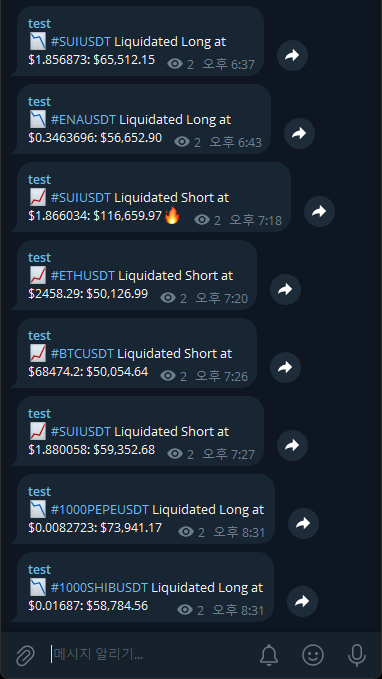

# binance-liquidation-telegram
Binance Futures Websocket All Market Liquidation Alert for Telegram<br><br>

## Feature
- Fetchs all liquidation trades from Binance Futures
- Calculates the liquidation value and compares it to a defined threshold.
- If the liquidation value exceeds the threshold, bot send message to telegram channel.<br><br>

## Quick Start
1. Clone the repository
```bash
git clone https://github.com/2perday/binance-liquidation-telegram.git
```
2. Navigate to the project directory
```bash
cd binance-liquidation-telegram
```
3. Install dependencies
```bash
pip install -r requirements.txt
```
4. Rename the `.env.example` file to `.env` and update it with your configuration values.<br><br>

## Notes
- You can fetch specific cryptos by changing `URL` in `.env`. More information in Binance Futures Websocket API docs.
- Too low or Zero `THRESHOLD` may hit Telegram's rate limit and the bot may stop.<br><br>

## Example

